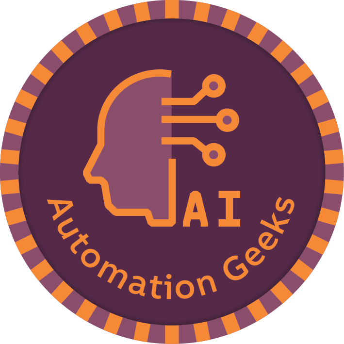
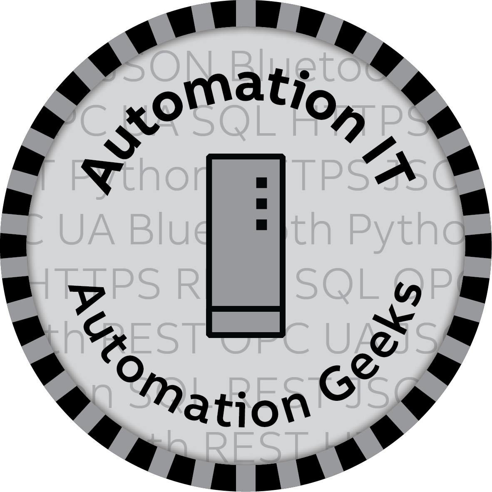
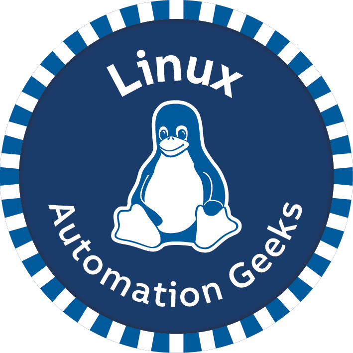
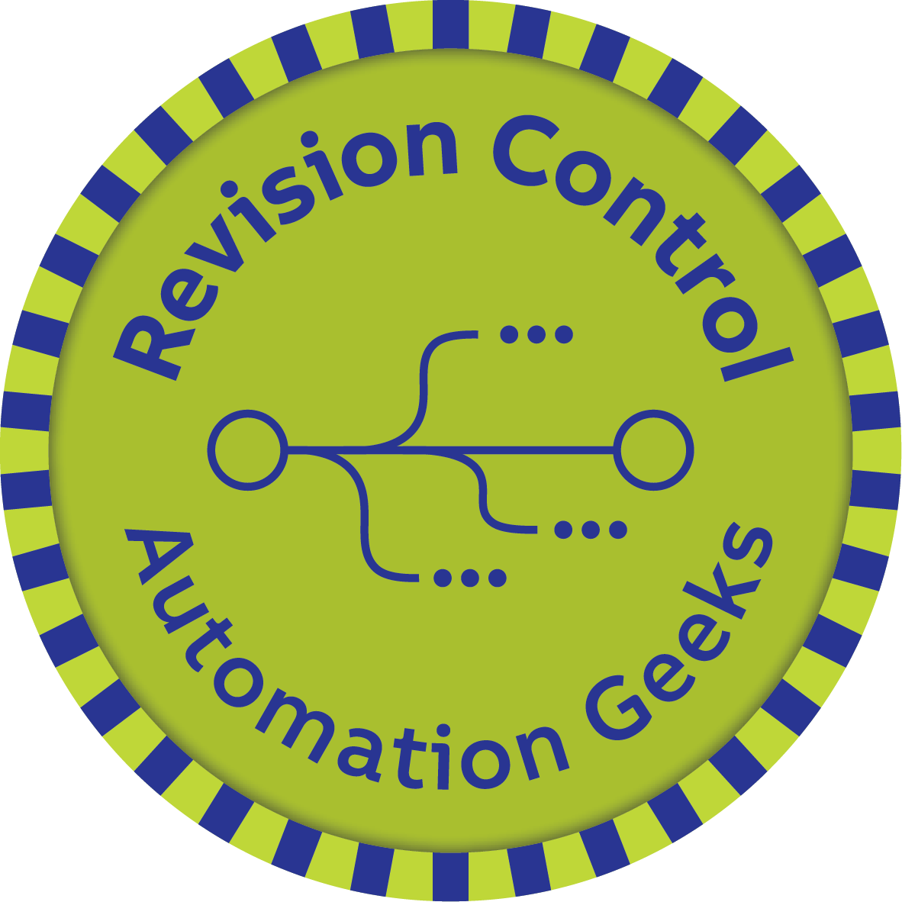
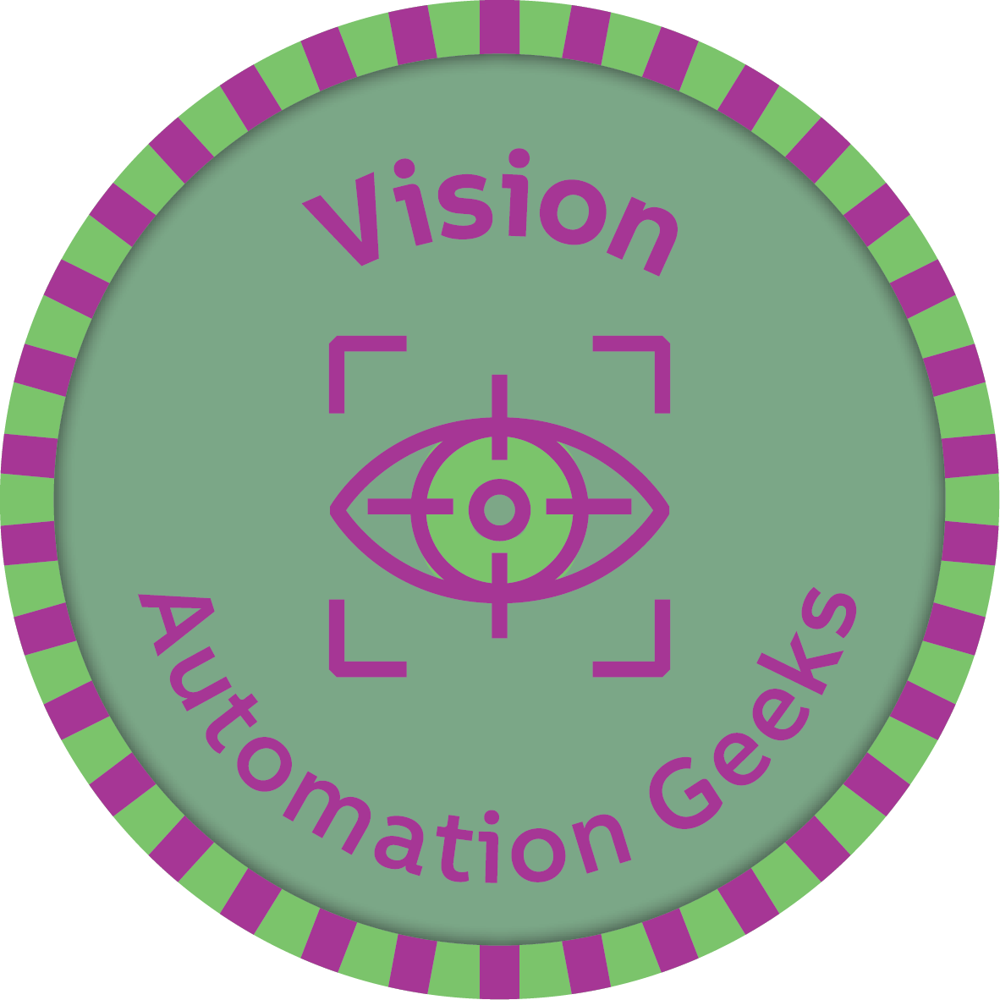

# Hi, I'm Andreas

I work as a Software Developer at [B&R Industrial Automation](https://github.com/BRDK-GitHub) in Denmark.
I'm currently doing Business Enablement, to increase effeciency and expand horizons across the company.
   
I graduated from Aalborg University in 2023 with an M.Sc in Vision, Graphics and Interactive Systems, and a B.Sc in Robotics.

## Automation Geek Certifications
    
